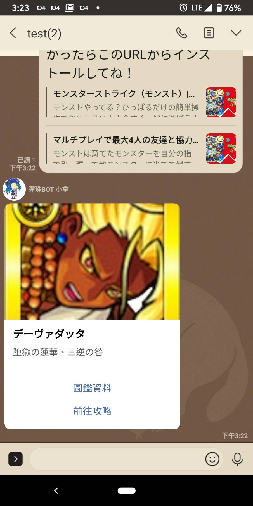

# 怪物彈珠BOT-小拿

# 目的
- 練習nodejs專案建立line機器人
- 增加彈珠line群組內的互動
- 宣傳喜歡的腳色>///<

# 介紹

## 指令說明
輸入`小拿 hlep` 或 `小拿 幫助`會有說明

## choice小遊戲
輸入 `小拿 {事情} choice {選項1} {選項2}` 或者 `小拿 choice {選項1} {選項2}`

- 選項可以N個
- 選項之前可以加',' 變成 `小拿 {事情} choice {選項1},{選項2}`

## 共鬥網址連結找攻略網站

- 利用`怪物彈珠app`內建line共鬥功能；把邀請貼到BOT看的到地方
- 目前僅支援一般降臨/爆絕/超絕/轟絕 (不支援玉樓/霸塔/神殿)

 

## 學習模式
輸入 `小拿 學習 {偵測的文字} {回應的文字}`

- 重複的話會隨機挑一個回話
- 目前不支援刪除功能

# 成長紀錄
- 2019.11.08	學習自我介紹(教學功能)
- 2019.11.04	學習choice小遊戲
- 2018.3.18		學會會識別共鬥url,並找功略網址
- 2018.2.18		學習去找攻略網站
- 2018.2.18		學習字詞回話功能 (對話內容存入[google sheet](https://docs.google.com/spreadsheets/d/1F_fovnhADVmhZTSKgfslifveEOWdIGMJnkmKQ2P0EJA/edit#gid=758670439) )
- 2018.2.17		小拿誕生!!

# 使用技術
1. Node.js
2. 串接google api (google 表單)
3. 爬蟲-遊戲[攻略網站](https://xn--eckwa2aa3a9c8j8bve9d.gamewith.jp/)
